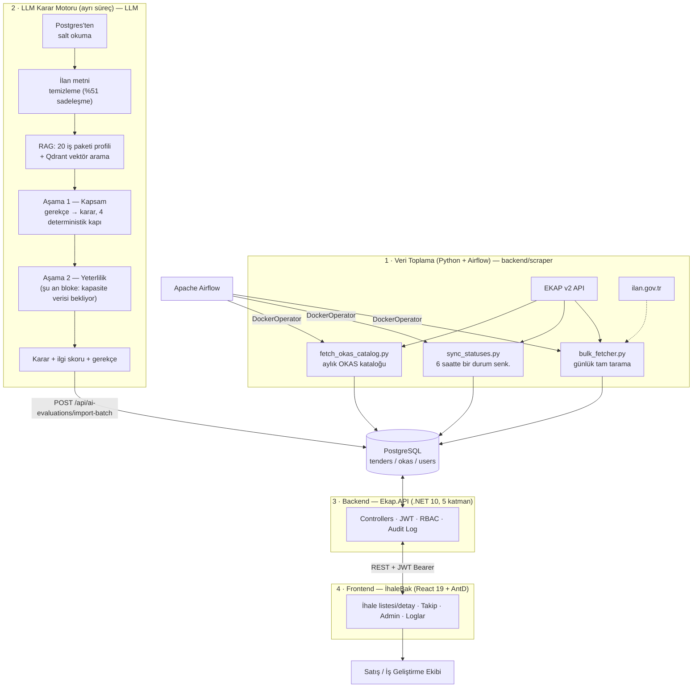

# İSBAK EKAP — Akıllı İhale Analiz Platformu

> Kamu ihalelerini otomatik toplayan, yerelde çalışan bir LLM karar motoruyla İSBAK'ın faaliyet alanına göre gerekçeli şekilde önceliklendiren, rol bazlı yetkilendirmeyle şirket içi kullanıcılara sunan uçtan uca karar destek sistemi.

---

## Problem

EKAP (Elektronik Kamu Alımları Platformu) üzerinde her gün yüzlerce yeni ihale ilanı yayımlanıyor. İSBAK'ın ilgi alanına girenleri elle ayıklamak, binlerce aktif ilanı tek tek okumayı gerektiriyor — pratikte mümkün değil.

## Çözüm

Sistem ihaleleri otomatik toplar, yerelde çalışan bir dil modeliyle her ilanı okur, İSBAK'ın 20 iş paketi profiliyle karşılaştırır ve **gerekçesini kararından önce üreterek** "uygun / belirsiz / uygun değil" etiketi + ilgi skoru atar. Amaç yapay zekânın insanın yerine karar vermesi değil, uzmanın incelemesini kısaltılmış bir aday listesine odaklamaktır.

## Ölçülen Sonuç

| Metrik | Sonuç |
|---|---|
| Kaçırma seti (uzman onaylı) | **30/30 — kaçırma 0** |
| Yanlış alarm seti | 18/20 |
| ~4.450 aktif ihalede aday oranı | **~%7** |

Modelin üstünde dört deterministik kural kapısı çalışır (skor/karar tutarlılığı, uydurma paket yakalama, belirsiz/reddet sınırı, retrieval eşiği) — her biri gerçek bir hata modundan doğdu ve testle korunuyor.

---

## Dokümantasyon

<table>
  <tr>
    <td valign="top" width="190">
      <h4>📍 Bu sayfada</h4>
      <table>
        <tr><td align="right"><code>1</code></td><td><a href="#uçtan-uca-sistem-mimarisi"><b>Mimari</b></a></td></tr>
        <tr><td align="right"><code>2</code></td><td><a href="#depolarımız"><b>Depolarımız</b></a></td></tr>
        <tr><td align="right"><code>3</code></td><td><a href="#öne-çıkan-özellikler"><b>Özellikler</b></a></td></tr>
        <tr><td align="right"><code>4</code></td><td><a href="#teknoloji-yığını"><b>Teknoloji</b></a></td></tr>
        <tr><td align="right"><code>5</code></td><td><a href="#geliştirici-ekibi"><b>Ekip</b></a></td></tr>
      </table>
    </td>
    <td valign="top">
      <h4>📚 Teknik dokümantasyon</h4>
      <table>
        <tr><th>#</th><th>Doküman</th><th>İçerik</th></tr>
        <tr><td align="center"><code>00</code></td><td><a href="https://github.com/Isbak-Ekap/backend/blob/main/docs/onboarding/00-giris.md"><b>Giriş</b></a></td><td>Ürün, uçtan uca mimari, 4 repo, domain sözlüğü</td></tr>
        <tr><td align="center"><code>01</code></td><td><a href="https://github.com/Isbak-Ekap/backend/blob/main/docs/onboarding/01-backend-turu.md"><b>Backend Turu</b></a></td><td>.NET 5 katman + veri toplama (scraper, Airflow)</td></tr>
        <tr><td align="center"><code>02</code></td><td><a href="https://github.com/Isbak-Ekap/backend/blob/main/docs/onboarding/02-frontend-turu.md"><b>Frontend Turu</b></a></td><td>React yapısı, routing, auth akışı</td></tr>
        <tr><td align="center"><code>03</code></td><td><a href="https://github.com/Isbak-Ekap/backend/blob/main/docs/onboarding/03-llm-turu.md"><b>LLM Turu</b></a></td><td>Karar zinciri, RAG, entegrasyon</td></tr>
        <tr><td align="center"><code>04</code></td><td><a href="https://github.com/Isbak-Ekap/backend/blob/main/docs/onboarding/04-backend-llm-konfigurasyonu.md"><b>Backend &harr; LLM Konfigürasyonu</b></a></td><td>Ayar nerede yaşar, temas sözleşmesi</td></tr>
        <tr><td align="center"><code>05</code></td><td><a href="https://github.com/Isbak-Ekap/backend/blob/main/docs/onboarding/05-backend-endpoint-iliskisi.md"><b>Backend &harr; Endpoint İlişkisi</b></a></td><td>Endpoint envanteri, yetkilendirme, katman haritası</td></tr>
        <tr><td align="center"><code>06</code></td><td><a href="https://github.com/Isbak-Ekap/backend/blob/main/docs/onboarding/06-faz2-hazirlik.md"><b>Faz 2 Hazırlık</b></a></td><td>Faz 1 durumu, teknik borç, yol haritası</td></tr>
      </table>
    </td>
  </tr>
</table>

Teknik dokümantasyonu projeye yeni başlıyorsan sırayla oku. Kurulum ve API referansı için ilgili deponun kendi `README.md` dosyasına bakınız.

---

## Uçtan Uca Sistem Mimarisi

Üç depo birbirine yalnızca **HTTP/REST ve paylaşılan PostgreSQL** üzerinden bağlıdır; ortak kod veya paket paylaşımı yoktur, her biri kendi CI/CD pipeline'ıyla GHCR üzerinden bağımsız deploy edilir.

## Depolarımız

**[`backend`](https://github.com/Isbak-Ekap/backend) — API ve veri toplama**  
Kamu ihalelerini EKAP ve ilan.gov.tr üzerinden toplayıp PostgreSQL'de saklayan, rol bazlı yetkilendirmeyle REST API olarak sunan 5 katmanlı .NET uygulaması. Veri toplama tarafı Python betikleriyle yürür, Airflow ile zamanlanır.  
`.NET 10` · `ASP.NET Core Web API` · `EF Core` + `Npgsql` · `Identity` + `JWT` · `Python 3` · `Apache Airflow`  
Bağımlılık: PostgreSQL

**[`frontend`](https://github.com/Isbak-Ekap/frontend) — İhaleBak arayüzü**  
İhale listesini filtreleyip önceliklendirilmiş biçimde gösteren, takip listesi ve yönetim ekranlarını barındıran tek sayfa uygulaması. Menü ve ekranlar kullanıcının yetkisine göre dinamik şekillenir.  
`React 19` · `TypeScript 6` · `Vite 8` · `Ant Design 6` · `TanStack Query 5` · `React Router 7` · `Axios`  
Bağımlılık: `backend` REST API'si

**[`LLM`](https://github.com/Isbak-Ekap/LLM) — EkapUnified karar motoru**  
İlan metnini temizleyip 20 iş paketi profiliyle RAG üzerinden eşleştiren, iki aşamalı karar zinciriyle ilgi skoru ve gerekçe üreten ayrı süreç. Modeller yerelde çalışır, veri kurum dışına çıkmaz.  
`Python 3.14` · `Ollama (qwen3:4b/8b)` · `bge-m3` · `Qdrant` · `pydantic` · `pytest (88 test)`  
Bağımlılık: PostgreSQL (salt okuma) · Ollama · Qdrant

## Öne Çıkan Özellikler

**Akıllı önceliklendirme** — İlan metnini temizleyip 20 iş paketi profiliyle RAG üzerinden eşleştiren iki aşamalı karar zinciri; üretilen karar, ilgi skoru ve gerekçe ihale listesini otomatik önceliklendirir.

**Gelişmiş ihale yönetimi** — İl, ihale türü/usulü/durumu, OKAS kodu, tarih aralığı, serbest metin ve AI kararına göre filtreleme; sunucu taraflı sıralama/sayfalama; takip durumu yönetimi ve ayrı takip listesi ekranı.

**Kurumsal düzeyde yetkilendirme** — JWT tabanlı giriş, claim tabanlı dinamik RBAC (her endpoint/menü ayrı izin anahtarıyla korunur), rol değişiminde anlık oturum geçersiz kılma, hesap kilitleme ve rate limiting.

**Kalıcı denetim izi** — Takip durumu, profil, şirket tercihi ve admin işlemleri otomatik olarak `audit_logs` tablosuna yazılır; yetkiye bağlı Loglar sayfasından izlenir.

**Tam otomatik veri akışı** — Günlük tam tarama, 6 saatte bir durum senkronizasyonu, aylık OKAS katalog güncellemesi; Airflow ile zamanlanmış, Docker imajlarıyla çalışan pipeline.

## Teknoloji Yığını

| Katman | Teknoloji |
|---|---|
| Backend | .NET 10, ASP.NET Core Web API, EF Core (Npgsql), Identity + JWT, FluentValidation, AutoMapper, Swagger |
| Frontend | React 19, TypeScript 6, Vite 8, Ant Design 6, TanStack Query 5, React Router 7, Axios |
| Veri Toplama | Python 3, `httpx`, `psycopg2`, `pydantic`, `markitdown` |
| LLM Karar Motoru | Python 3.14, Ollama (`qwen3:4b`/`8b` — yerel, veri kurum dışına çıkmaz), `bge-m3` + Qdrant, pytest (88 test) |
| Veritabanı | PostgreSQL |
| Orkestrasyon & DevOps | Apache Airflow (`DockerOperator`), Docker, Nginx, GitHub Actions → GHCR → self-hosted runner |

## Geliştirici Ekibi

Bu proje İSBAK bünyesinde staj kapsamında geliştirilmektedir.

| İsim Soyisim | E-posta |
|---|---|
| **Metin Eren Uzun** | [metineren0061@gmail.com](mailto:metineren0061@gmail.com) |
| Mert Evran | [mertevran1907@gmail.com](mailto:mertevran1907@gmail.com) |
| Kerem Ünal | [kerem.unal2004@gmail.com](mailto:kerem.unal2004@gmail.com) |
| Özlem Demir | [demirezlem@gmail.com](mailto:demirezlem@gmail.com) |
| Hayrunnisa Yılmaz | [hayrunnisa0830@gmail.com](mailto:hayrunnisa0830@gmail.com) |
| Ahmet Bağbakan | [ahmet.bagbakan@hotmail.com](mailto:ahmet.bagbakan@hotmail.com) |
| Atalay Karakaya | [atalaykarakaya105@gmail.com](mailto:atalaykarakaya105@gmail.com) |
