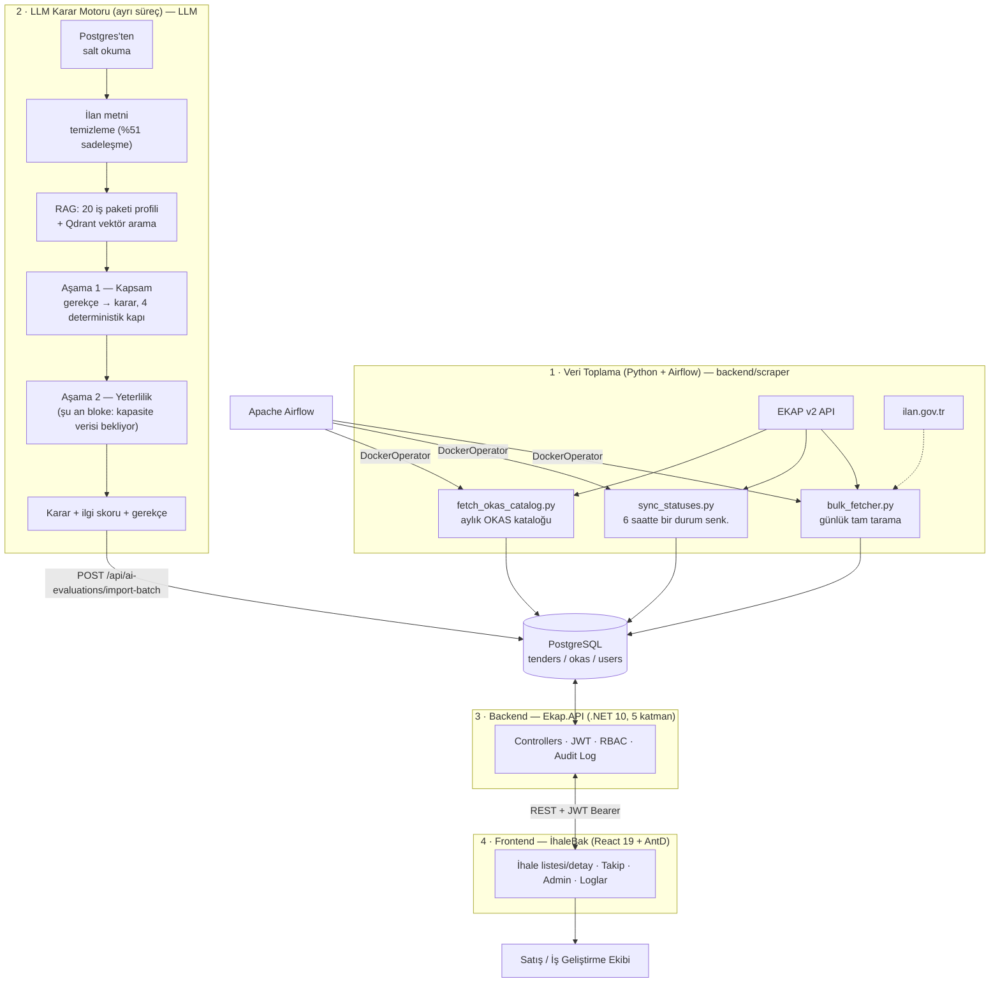

# İSBAK EKAP — Akıllı İhale Analiz Platformu

> EKAP (Elektronik Kamu Alımları Platformu) üzerinde yayımlanan kamu ihalelerini otomatik toplayan, ilan metnini temizleyip anlayan bir LLM karar motoruyla İSBAK'ın faaliyet alanına göre gerekçeli şekilde önceliklendiren, rol bazlı yetkilendirmeyle şirket içi kullanıcılara sunan uçtan uca sistem.
>
> Bu sayfa, organizasyonumuzdaki üç depoyu (**[`backend`](https://github.com/Isbak-Ekap/backend)**, **[`frontend`](https://github.com/Isbak-Ekap/frontend)**, **[`LLM`](https://github.com/Isbak-Ekap/LLM)**) tek bir yerden özetleyen genel bakış dokümanıdır. Kurulum, mimari, kullanılan teknolojiler ve üç parçanın birbirine nasıl bağlandığı burada özetlenir; parça bazlı tam teknik referanslar için ilgili bölümlerdeki depo linklerine bakınız.

[]()
[]()
[]()
[]()
[]()
[]()
[]()
[]()
[]()

---

## İçindekiler

1. [Proje Hakkında](#1-proje-hakkında)
2. [Uçtan Uca Sistem Mimarisi](#2-uçtan-uca-sistem-mimarisi)
3. [Depolarımız](#3-depolarımız)
4. [Öne Çıkan Özellikler](#4-öne-çıkan-özellikler)
5. [Teknoloji Yığını](#5-teknoloji-yığını)
6. [Backend — `backend`](#6-backend--backend)
7. [Frontend — `frontend` (İhaleBak)](#7-frontend--frontend-İhalebak)
8. [LLM Karar Motoru — `LLM`](#8-llm-karar-motoru--llm-ekapunified)
9. [Hızlı Başlangıç](#9-hızlı-başlangıç)
10. [Geliştirme İş Akışı (Git)](#10-geliştirme-iş-akışı-git)
11. [Bilinen Eksikler / Yol Haritası](#11-bilinen-eksikler--yol-haritası)
12. [Geliştirici Ekibi](#12-geliştirici-ekibi)

---

## 1. Proje Hakkında

İSBAK'ın ilgilendiği kamu ihaleleri EKAP üzerinde günde yüzlerce yeni ilanla yayımlanıyor; bunları elle takip etmek mümkün değil. Bu platform, o yükü ortadan kaldırmak için üç parçadan oluşan bir karar destek sistemi kurar:

1. **Veri toplama** — Python betikleri EKAP v2 API'sinden ve ilan.gov.tr'den ihale/ilan verisini çekip PostgreSQL'e yazar; Apache Airflow bu işi belirli bir takvimde otomatik tetikler.
2. **Yapay zekâ destekli değerlendirme** — ayrı bir LLM karar motoru (`LLM` / *EkapUnified*), yerelde çalışan bir dil modeliyle (Ollama, `qwen3`) her ihalenin ilan metnini okur, İSBAK'ın 20 iş paketi profiliyle karşılaştırır ve gerekçeli bir "uygun / belirsiz / uygun değil" kararı + ilgi skoru üretir.
3. **Sunum ve iş akışı** — .NET tabanlı bir backend API bu veriyi filtreler, sıralar, rol bazlı yetkilendirme ve kalıcı denetim izi sağlar; React tabanlı **İhaleBak** arayüzü bu veriyi satış/iş geliştirme ekibine sunar, ihaleleri takibe almalarını sağlar.

Amaç yapay zekânın insanın yerine karar vermesi değil, **binlerce aktif ihaleyi birkaç yüz gerçek adaya indirip** uzmanın incelemesini bu kısaltılmış listeye odaklamaktır — ölçülen kaçırma oranı hâlâ **0**.

## 2. Uçtan Uca Sistem Mimarisi



Üç depo birbirine yalnızca **HTTP/REST ve paylaşılan PostgreSQL veritabanı** üzerinden bağlıdır; ortak kod veya paket paylaşımı yoktur, her biri kendi CI/CD pipeline'ıyla GHCR üzerinden self-hosted sunucuya bağımsız deploy edilir.

## 3. Depolarımız

| Depo | İçerik | Bağımlılık |
|---|---|---|
| **[`backend`](https://github.com/Isbak-Ekap/backend)** | .NET 10 API (5 katman), Python scraper, Airflow DAG'leri, proje dokümanları | PostgreSQL |
| **[`frontend`](https://github.com/Isbak-Ekap/frontend)** | React 19 + TypeScript + Ant Design tek sayfa uygulaması (İhaleBak) | `backend` REST API'si |
| **[`LLM`](https://github.com/Isbak-Ekap/LLM)** | Python LLM karar motoru (*EkapUnified*) — RAG + iki aşamalı karar zinciri | PostgreSQL (salt okuma) · Ollama · Qdrant |

## 4. Öne Çıkan Özellikler

**İhale Yönetimi**
- Gelişmiş filtreleme: il, ihale türü/usulü/durumu, OKAS kodu, tarih aralığı, serbest metin arama, AI kararı/ilgi skoru, "sadece hatalı/eksik girilenler".
- Sunucu taraflı sıralama ve sayfalama; ihale detay sayfası (özellikler, OKAS kodları, resmi ilan/duyuru geçmişi, AI özet/skoru).
- Takip durumu yönetimi ("İnceleniyor" → "Alınması Öneriliyor" / "Alınması Önerilmiyor"), ayrı bir Takip Listesi ekranı.
- Dashboard: toplam/aktif ihale, il/tür dağılımı, en çok kullanılan OKAS kodları.

**Yapay Zekâ Destekli Karar Motoru**
- İlan metnini okuyup temizleyen, 20 iş paketi profiliyle RAG (Qdrant) üzerinden eşleştiren, gerekçesini kararından önce üreten iki aşamalı bir karar zinciri (Kapsam → Yeterlilik).
- Modelin üstünde dört deterministik kural kapısı (skor/karar tutarlılığı, uydurma paket yakalama, belirsiz/reddet sınırı, retrieval eşiği) — her biri gerçek bir hata modundan doğdu ve testle korunuyor.
- Uzman onaylı setlerde ölçülen sonuç: kaçırma seti **30/30** (kaçırma 0), yanlış alarm seti **18/20**; ~4.450 aktif ihalede aday oranı **~%7**.
- Üretilen karar (`uygun`/`belirsiz`/`uygun_degil`), ilgi skoru ve gerekçe `/api/ai-evaluations/import-batch` ile backend'e toplu aktarılır; ihale listesi bu veriye göre önceliklendirilir.

**Kimlik Doğrulama & Yetkilendirme**
- JWT tabanlı giriş, "Beni Hatırla" ile 8 saat / 30 gün token ömrü.
- Claim tabanlı RBAC — her endpoint/menü/rota ayrı bir izin anahtarıyla korunur; roller/izinler Admin API üzerinden dinamik yönetilir.
- Anlık oturum geçersiz kılma (rol/izin değişince eski token otomatik reddedilir), hesap kilitleme, login rate limiting.

**Şirket Tercihleri & Yönetici Paneli**
- OKAS kodları + anahtar kelimeler yönetimi (AI eşleştirme motorunun girdisi), 9.590+ kayıtlı master OKAS kataloğunda anlık arama.
- Kullanıcı/rol CRUD, rol-izin ataması, SuperAdmin rolünün korunması.

**Denetim İzi (Audit Log)**
- İhale takip durumu, şifre/profil, şirket tercihi, admin kullanıcı/rol işlemleri otomatik olarak `audit_logs` tablosuna yazılır; sunucu taraflı, kalıcı, yetkiye bağlı (`logs.view`) bir Loglar sayfasından izlenir.

**Diğer**
- Türkçe yerelleştirme, tam metin aramalı Kullanıcı Kılavuzu.
- Otomatik veri toplama (günlük tam tarama, 6 saatte bir durum senk., aylık OKAS güncellemesi).
- Kendi kendini kuran veritabanı (migration + seed), Swagger/OpenAPI ile otomatik belgelenen API.

## 5. Teknoloji Yığını

| Katman | Teknoloji |
|---|---|
| Backend Runtime | .NET 10.0, ASP.NET Core Web API |
| Veritabanı | PostgreSQL, Entity Framework Core (Npgsql, snake_case naming) |
| Backend Kimlik & Yetki | ASP.NET Core Identity, JWT Bearer, özel `AuthorizePermissionAttribute` (claim tabanlı RBAC) |
| Backend Validasyon/Mapping | FluentValidation, AutoMapper |
| Backend Dokümantasyon | Swashbuckle (Swagger/OpenAPI) |
| Frontend Framework | React 19 + TypeScript ~6.0, Vite 8 |
| Frontend UI | Ant Design (antd) 6 + `@ant-design/icons` |
| Frontend Sunucu Durumu | TanStack Query (React Query) 5 |
| Frontend Yönlendirme | React Router DOM 7 |
| Frontend HTTP | Axios 1, Day.js (`tr` locale) |
| Veri Toplama | Python 3, `httpx`, `psycopg2`, `pydantic`, `markitdown`, `apscheduler` |
| Orkestrasyon | Apache Airflow (`DockerOperator`) |
| LLM Karar Motoru | Python 3.14, Ollama (`qwen3:4b` / `qwen3:8b` — yerel, veri kurum dışına çıkmaz) |
| Embedding / Vektör Arama | `bge-m3` (1024 boyut), Qdrant |
| LLM Yapılandırılmış Çıktı | Pydantic şemaları, pydantic-settings |
| LLM Test/Ölçüm | pytest (88 test), versiyonlanmış koşu kayıtları (`Sonuclar/`) |
| Konteynerizasyon | Docker (multi-stage), Docker Compose, Nginx (frontend) |
| CI/CD | GitHub Actions → GHCR → self-hosted runner |

---

## 6. Backend — `backend`

.NET 10 ile yazılmış, bağımlılıkların tek yönde (dıştan içe) aktığı **Clean Architecture / N-Layer** prensibiyle 5 sınıf kütüphanesine bölünmüş bir Web API: `Ekap.API` (controller/middleware) → `Ekap.Business` (servisler/DTO/validasyon) → `Ekap.Core` (bağımlılıksız domain) ← `Ekap.DataAccess` (EF Core/repository) ve `Ekap.Infrastructure` (JWT/cache/log). Aynı depo altında EKAP'tan veri çeken Python **scraper** betikleri ve bunları takvime bağlayan **Airflow** DAG'leri de bulunur.

```bash
git clone https://github.com/Isbak-Ekap/backend.git
cd backend
cp .env.example .env        # DB_HOST/PORT/NAME/USER/PASSWORD
dotnet restore Ekap.sln
dotnet run --project src/Ekap.API/Ekap.API.csproj   # migration + seed otomatik, Swagger: /swagger
```

Tam API referansı, RBAC izin listesi, veri modeli ve Docker/CI-CD detayları için → **[`backend` reposu](https://github.com/Isbak-Ekap/backend)**.

## 7. Frontend — `frontend` (İhaleBak)

React 19 + TypeScript + Vite ile yazılmış, Ant Design tabanlı tek sayfa uygulaması. `backend` API'sini tüketir; kendi başına veri toplamaz. Feature-first klasörleme (`src/features/{auth,dashboard,tenders,admin,settings,logs,help}`), TanStack Query ile sunucu durumu yönetimi, izin bazlı arayüz gizleme.

```bash
git clone https://github.com/Isbak-Ekap/frontend.git
cd frontend
npm install
npm run dev       # Vite geliştirme sunucusu — backend'in ayakta olması gerekir
```

Ortam değişkenleri, kimlik doğrulama akışı ve Docker/CI-CD detayları için → **[`frontend` reposu](https://github.com/Isbak-Ekap/frontend)**.

## 8. LLM Karar Motoru — `LLM` (EkapUnified)

Canlı PostgreSQL'e **salt okuma** erişen, ayrı ve bağımsız çalışan bir Python servisi. Her ihale için: ilan metnini temizler → RAG ile 20 iş paketi profili + geçmiş kararlarla eşleştirir → Aşama 1'de "İSBAK'ın alanına giriyor mu?" sorusuna gerekçeli karar üretir (Aşama 2 "yeterlilik" kontrolü şu an kurumsal kapasite verisi beklediği için bloke). Sonuçlar backend'in `/api/ai-evaluations/import-batch` uç noktasına gönderilir; kendi tablosu dışında hiçbir tabloya yazmaz.

```bash
git clone https://github.com/Isbak-Ekap/LLM.git
cd LLM
pip install -r requirements.txt
cp .env.example .env
python scripts/check_setup.py          # 7/7 bekleniyor
python scripts/tara_ve_kaydet.py --n 5 --rastgele   # tarama + etiketleme
```

Ölçülen sonuçlar, deterministik kural kapıları, mimari ve bilinen sorunlar için → **[`LLM` reposu](https://github.com/Isbak-Ekap/LLM)**.

## 9. Hızlı Başlangıç

Üç parçayı yerelde birlikte ayağa kaldırmak için önerilen sıra:

1. **PostgreSQL** — üç parçanın da ortak veri kaynağı; bağlantı bilgilerini her deponun `.env` dosyasına girin.
2. **Backend** — çalıştırıldığında migration + seed otomatik uygulanır, `/swagger` ile API keşfedilebilir.
3. **Frontend** — `VITE_API_BASE_URL` backend adresine işaret etmeli.
4. **LLM Karar Motoru** — isteğe bağlı; Ollama'nın yerelde çalışıyor olması ve `DATA_BACKEND` ile veritabanına salt okuma erişimi gerekir. Üretmediği sürece ihale listesinde AI kararı/skoru görünmez, sistemin geri kalanı sorunsuz çalışır.

Üretim ortamında üç depo de bağımsız GitHub Actions pipeline'larıyla GHCR üzerinden aynı self-hosted sunucuya deploy edilir; veri toplama ve LLM taraması Airflow ile otomatik tetiklenir.

## 10. Geliştirme İş Akışı (Git)

- **`main`** — üretime dağıtılan kararlı dal, yalnızca haftalık senkronla (`dev` → `main` PR) güncellenir.
- **`dev`** — fiilen "güncel/kararlı" kabul edilen ana geliştirme dalı.
- **Feature branch'ler** `dev`'den açılır, PR ile `dev`'e geri birleşir; `dev`/`main`'e doğrudan push yoktur, trivial değişiklikler dahil her şey PR'dan geçer.
- İş takibi hem her deponun `docs/` / `plan/` klasöründeki tarih damgalı görev dosyalarıyla hem GitHub issue'larıyla yürütülür.

## 11. Bilinen Eksikler / Yol Haritası

- **Test altyapısı** — backend'de otomatik test projesi yok, frontend'de Vitest dosyaları var ama script/bağımlılık eksik; LLM tarafında ise 88 testlik olgun bir pytest paketi zaten mevcut.
- **Migration geçmişi eksik** (backend) — yalnızca `audit_logs` migration'ı var, sıfırdan ortam kurulumu şu an mümkün değil.
- **Dashboard özet endpoint'i yok** — istatistikler istemci tarafında `/api/ihaleler`'den hesaplanıyor.
- **LLM Aşama 2 (yeterlilik) bloke** — kurumsal kapasite verisi (iş deneyim belgesi, personel, sertifika) toplanmadan devreye alınamıyor; bu, LLM tarafındaki en öncelikli açık iş kalemi.
- **Bildirim mekanizması yok** — yeni eşleşen ihale veya yaklaşan son tarih için proaktif uyarı yok.
- **Tek şirket/tenant varsayımı** — departman/bölge bazlı görünürlük ayrımı yok.

Faz 2 için tam gerekçeli yol haritası: [`backend` deposu → `docs/PROJE_RAPORU_VE_FAZ2_YOL_HARITASI.md`](https://github.com/Isbak-Ekap/backend/blob/main/docs/PROJE_RAPORU_VE_FAZ2_YOL_HARITASI.md); LLM tarafının açık sorunları: [`LLM` deposu → `plan/DEVAM-BURADAN.md`](https://github.com/Isbak-Ekap/LLM/blob/main/plan/DEVAM-BURADAN.md).

## 12. Geliştirici Ekibi

Bu proje İSBAK bünyesinde staj kapsamında geliştirilmektedir.

| İsim Soyisim | E-posta |
|---|---|
| **Metin Eren Uzun** | [metineren0061@gmail.com](mailto:metineren0061@gmail.com) |
| Mert Evran | [mertevran1907@gmail.com](mailto:mertevran1907@gmail.com) |
| Kerem Ünal | [kerem.unal2004@gmail.com](mailto:kerem.unal2004@gmail.com) |
| Özlem Demir | [demirezlem@gmail.com](mailto:demirezlem@gmail.com) |
| Hayrunnisa Yılmaz | [hayrunnisa0830@gmail.com](mailto:hayrunnisa0830@gmail.com) |
| Ahmet Bağbakan | [ahmet.bagbakan@hotmail.com](mailto:ahmet.bagbakan@hotmail.com) |
| Atalay Karakaya | [atalaykarakaya105@gmail.com](mailto:atalaykarakaya105@gmail.com) |
